# your web app is bloated

Using firefox's memory snapshot tool,
I measured the heap usage of a variety of web apps.
Here is how everything did.

App | Memory (MiB = 10242 B)
--- | ---:
google inbox |  215 (!!!)
gmail (standard) |  158
google sheets (spreadsheet) |  96.98
slack |  76.53
google-maps |  65.61
patchbay (patchlite) | 59.93
youtube video |  59.04
nytimes |  56.08
facebook messenger | 57.78
facebook newsfeed |  56.12
riot |  55.31
toggle |  49.77
google docs (document) |  46.57
soundcloud (track open) |  45.80
hackmd (document) |  44.9
reddit |  43.77
airbnb | 40.8
jitsi |  40.21
tweetdeck |  40.38
the onion |  38.30
rocketchat |  32.12
open collective |  31.22
vimeo (video) | 31.15
youtube |  30.00
sandstorm (spreadsheet) |  27.63
pinterest |  26.80
images.google (result) |  26.41
twitter |  25.09
google docs |  24.7
facebook |  23.49
soundcloud |  22
spotify | 19.64
medium |  18.53
medium (article) |  17.99
bandcamp |  14.86
google results |  14.77
patchless | 12.43
google-maps-mobile | 12.06
google |  11.30
google hangouts |  10.76
talky |  9.40
bandcamp (album page) |  8.76
dat-shopping-list | 8.28
gmail-mobile | 7.93
the guardian |  7.36
duckduckgo images (result) |  7.31
github |  7.41
openstreetmap (on new york, transportation layer) |  6.72
wikipedia page |  5.93
duckduckgo |  5.63
meatspace chat |  4.48
duckduckgo results |  4.81
stackoverflow |  2.55
wikipedia |  1.73
gmail (vintage) |  0.81

# Method

I opened each site in firefox, and used the memory shapshot tool.
I screen shotted the output using `scrot`. I was running `ublock`,
and that probably made some sites smaller.

## Work

### github - 7.41 MB

github homepage (my news feed)

### google - 11.30 MB

empty google page. A surprising amount of memory used since it shows nothing but a single field.

### google results - 14.77 MB

prehaps still a lot of memory considering very little images or real time interactions here.

### duckduckgo - 5.63 MB

much less memory than google! I guess it's the tracking features in google that uses the extra memory!

### duckduckgo results - 4.81 MB

### google images (result) - 26.41 MB

fairly efficient, compared to reddit, youtube etc

### duckduckgo images (result) - 7.31 MB

1/3 the memory google images uses

### wikipedia - 1.73 MB

### wikipedia (article) - 5.93 MB

static page with some images

### stackoverflow - 2.55 MB

static site

### google docs - 24.7 MB

### google docs (document) - 46.57 MB

this seems like more than should be necessary. mainly js objects.

### google sheets (spreadsheet) - 96.98 MB

a lot of memory, especially considering spreadsheets were the killer app back in the apple 2
days, where lots of people brought computers for the first time to run visicalc on 64k of memory?

### hackmd (document) - 44.9 MB

about the same as a google doc

### sandstorm (spreadsheet) - 27.63 MB

almost 1/4 that of google spreadsheets.

### toggl - 49.77 MB

time tracking software, quite bloated.

---

## Social / Comms

### twitter - 25.09 MB

loaded twitter homepage and didn't scroll or touch anything

### tweetdeck - 40.38 MB

twitter power user interface, with mentions and messages, one user's feed, and a search feed
added.

## twitter (mobile) - 30.84

not better than regular web twitter

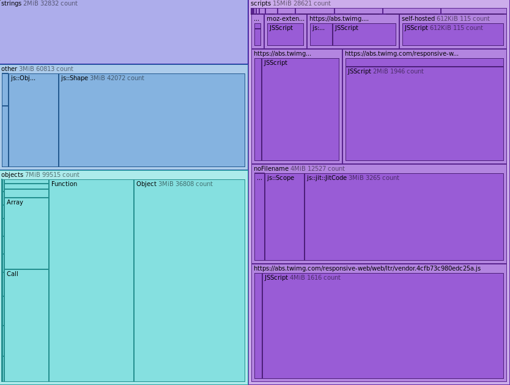

### reddit - 43.77 MB

the reddit homepage has an infinite scroller, usually means lots of javascript and js objects.

## facebook - 23.49 MB

just the login page! already a lot of javascript has been loaded.
The most bloated landing page, twice as much as google, 10x wikipedia.

## facebook newsfeed - 56.12 MB

a lot of objects are in memory, presumably this is from using react.

## facebook messenger - 57.78 MB

same memory use as fb news feed. react, of course.

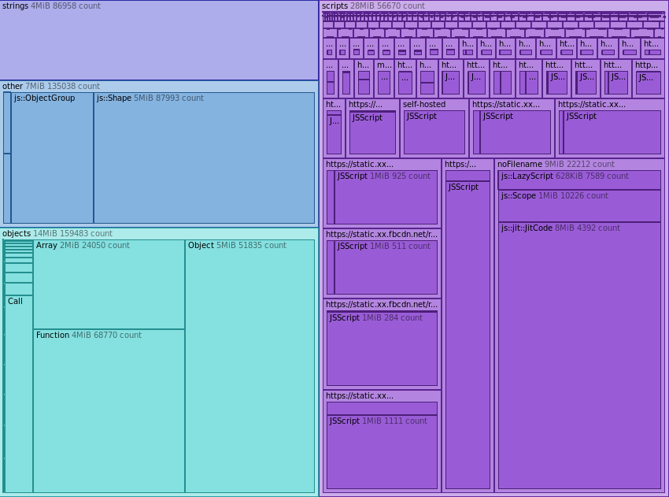

## gmail (basic) - 0.81 MB

nearly nothing! I use this daily. Really, it's an amazing level of functionality and user-friendlyness,
packed into a very simple interface. Also, because it doesn't have any
kind of dynamic updates, it's less distracting than the other email interfaces. You have to
intentionally check for emails, there is no notifications or changing favicons. so ugly it's beautiful.

## gmail (mobile) - 7.93 MB

Google's mobile apps are respectable.
again, pretending to be a nexus 5.

## gmail (standard) - 158 MB

amazingly bloated. mostly massive amounts of javascript (it has a progress bar that shows at startup)
but just the JS objects are 37 mb.

## google inbox - 215  MB (!!!)

makes standard gmail look tame. did they take gmail standard and just add more stuff?

## slack - 76.53 MB

bloated! largely javascript.

## rocketchat - 32.12 MB

does the same thing as slack, but with less javascript.
rocketchat is mostly js objects, but still less than slack.

## riot - 55.31 MB

more js objects than slack, but less javascript.

## meatspace chat - 4.48 MB

as tight as a static site, but does crazy javascript stuff!

---

## video

## youtube (mobile) - 5.49 MB

just the landing page. acceptable.

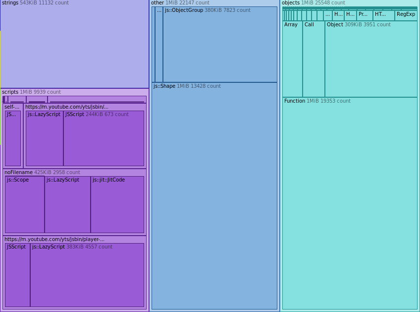

## youtube (mobile, playing video) - 15.94 MB

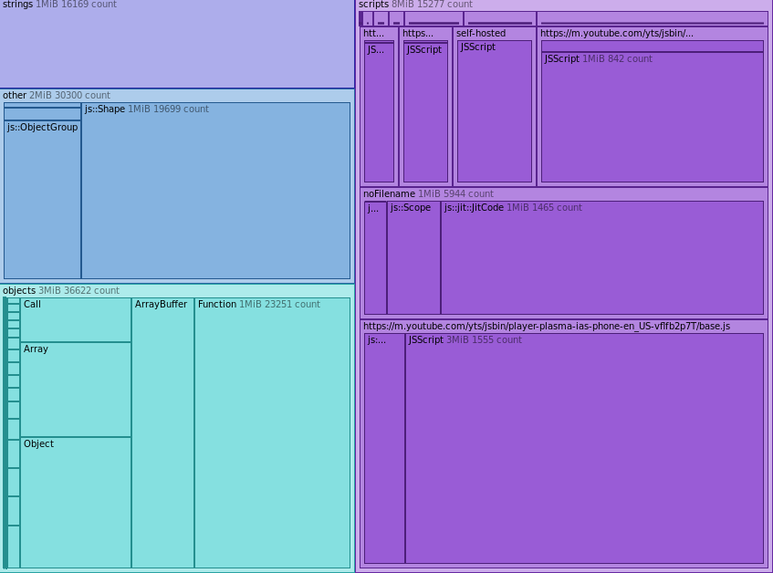

## youtube - 30.00 MB

pretty light weight considering it's youtube

## youtube (video) - 59.04 MB

At first I thought this was reasonable (since you are playing video)
but then I discovered that actually you can play video with a lot less!

## vimeo (video) - 31.15

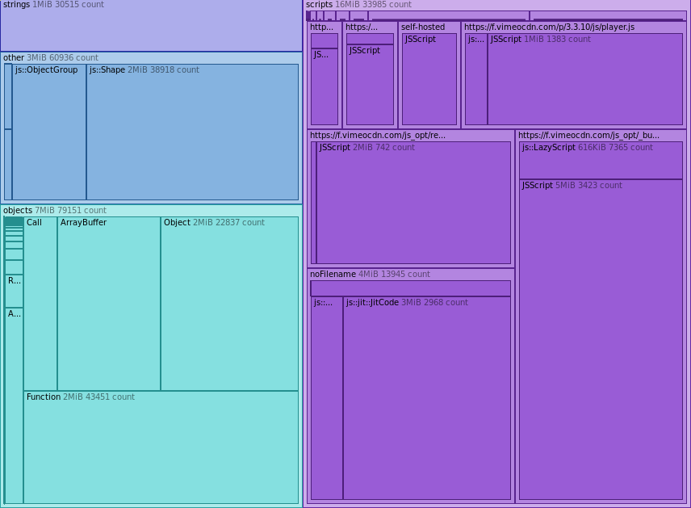

## maps

### google-maps - 65.61 MB

Pretty heavy compared to the other options.
I've been informed that this uses webgl, but the mobile version only uses tiles.

### openstreetmap - 6.72 MB

only 10% the memory of google maps and does essentially the same thing!

on new york, with transportation layer enabled

### google-maps (mobile) - 12.06

pretending to be a nexus 5. Much better!
you can also force this version by adding `?force=pwa` to [google-maps url](https://maps.google.com/?force=pwa)

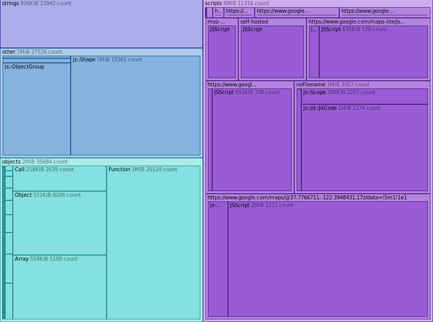

---

## news / content

### nytimes - 56.08 MB

very bloated.

### the guardian - 7.36 MB

pretty good.

### the onion - 38.30 MB

quite bloated, nearly as much as reddit, but is created entirely by their in-house writers.

### medium - 18.53 MB

could be better, but not as bad as others.

### medium (article) - 17.99 MB

---

## music

### soundcloud - 22 MB

better than youtube

### soundcloud (track open) - 45.80 MB

better than youtube

### bandcamp - 14.86 MB

front page has listings, memory use similar to google search results.
the best content site.

### bandcamp (album page) - 8.76 MB

pretty tight!

### spotify

Impressive!

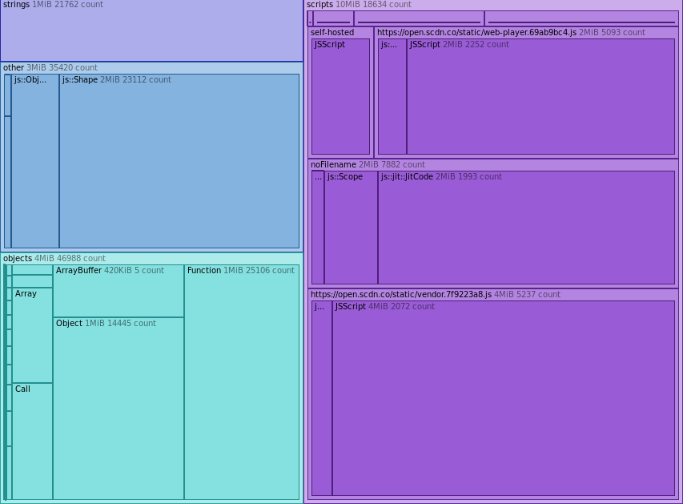

---

## video chat

### talky - 9.40 MB

started a call with no one else in it. pretty tight!

### google hangouts - 10.76 MB

on a call by my self. also surprisingly unbloated!

### jitsi - 40.21 MB

4x google hangouts.

## other

### pinterest - 26.80 MB

about the same as google images

### airbnb - 40.8 MB

Searched for "san francisco". A lot of memory used to just display a list,
especially considering there is no map displayed. Smells like react.

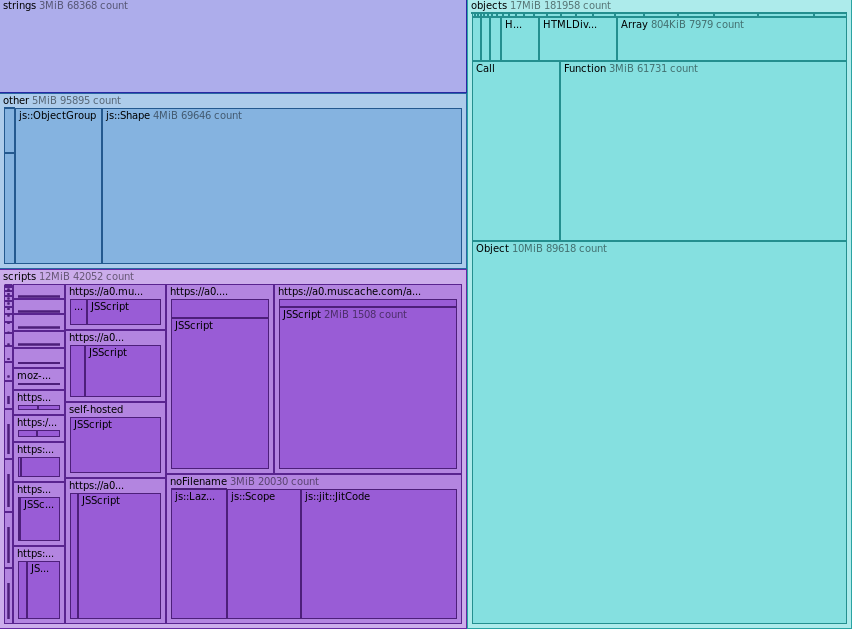

### open collective - 31.22 MB

react site, but it's not data that changes very often. pretty bloated.

--

## p2p

### patchless - 12.43 MB

A [social p2p client](http://github.com/patchless/patchless) with heavy javascript, including infinite scrollers!

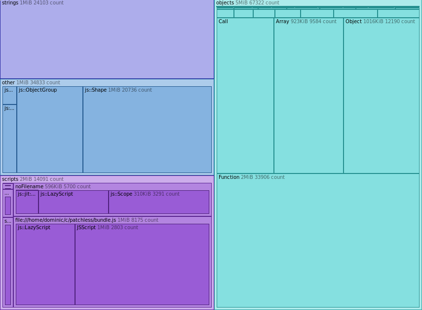

### dat-shopping-list - 8.28 MB

simple [shopping list app on dat](https://dat-shopping-list.glitch.me/)

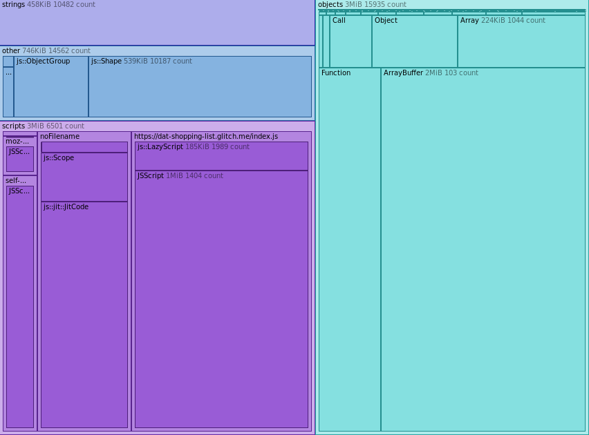

### patchbay (patchlite) - 59.93

slightly old version of [patchbay](https://github.com/ssbc/patchlite) because it could be bundled and run inside firefox.

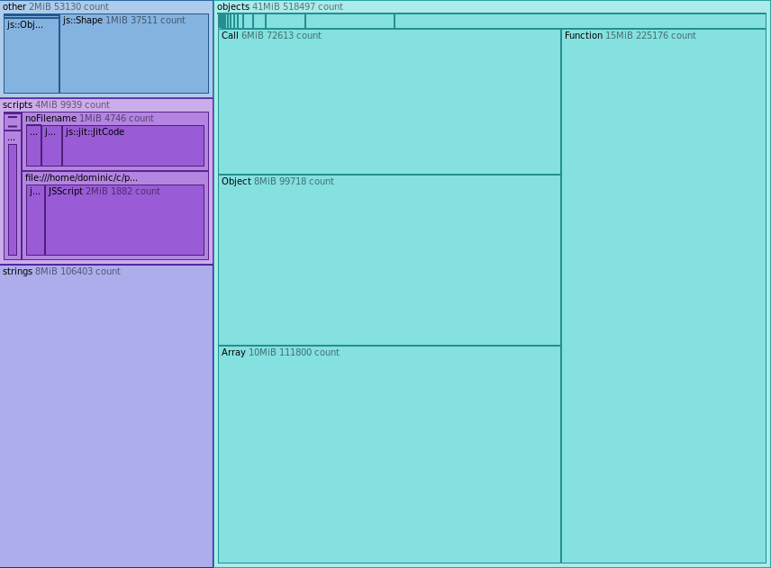

# conclusions

I started exploring this because I was trying to figure out how to optimize my own apps.
Memory use isn't the most important thing, but it is an easy to measure proxy. If you have
less memory usage, you probably have a simpler app, which is probably more performant.
Less memory also means lees garbage collection activity.

google's apps are particularly interesting because they provide both the worst offenders
(gmail, inbox, docs), but their mobile apps are really solid!

Recently, web development style has moved towards a fully dynamic front end that generates
everything in javascript. If a app really is highly dynamic, I guess that is somewhat excusable,
(such as facebook or slack) but I on a site that could be static it obviously uses a lot more.

I think this just shows there is considerable room for improvement in terms of application efficiency.

